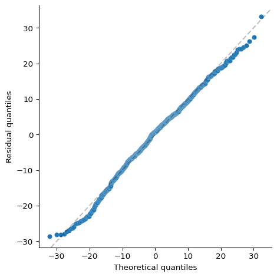
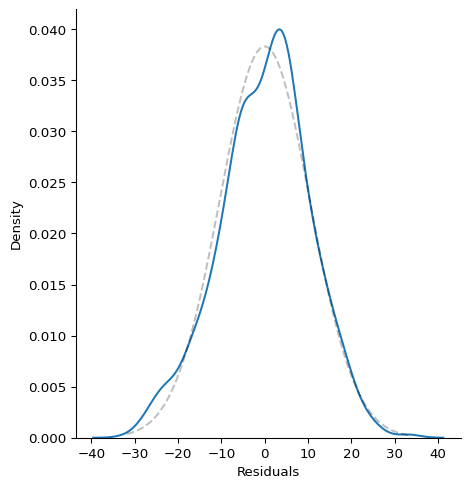
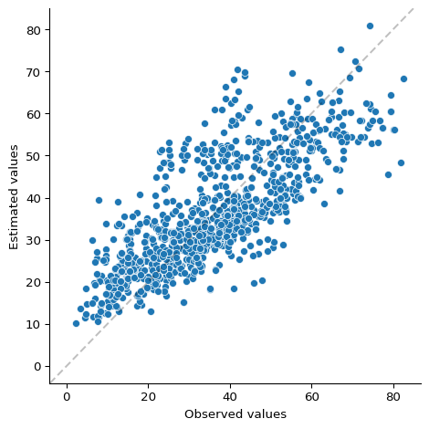
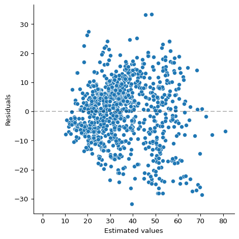
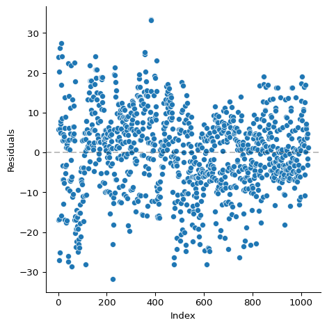
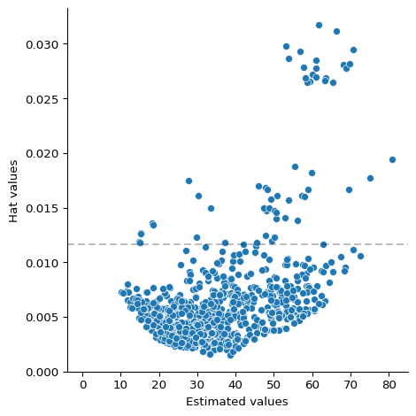
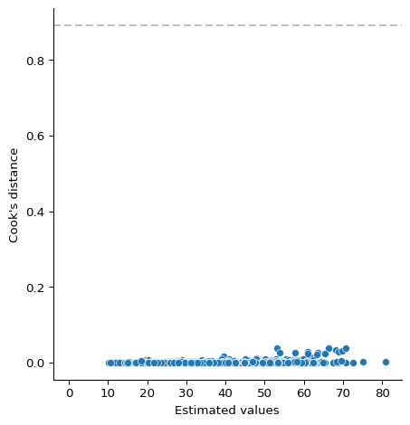

# Rekekssion


The linear regression package for the lazy:

- create a linear model with `rekekssion.fit()`
- get all the info you need with the `.summary()` method
- plot model suppositions and diagnostics with `.plot()`:
  - **normality**: residual’s qq and density plots
  - **linearity**: observed vs estimated values
  - **homoscedasticity**: estimated values vs residuals
  - **autocorrelation**: index vs residuals
  - **leverage**: estimated values vs hat values
  - **influence**: estimated values vs cook’s distance
- extract specific info with `.coefficients()`, `.estimated()`
  `.residuals()` if you’re into that
- evaluate new data with `.predict()`

Comes with 3 datasets inside `rekekssion.data` to play around:
`biomass`, `concrete` and `cpu`. You can set significance level $\alpha$
of the summary and the kind of residuals (`"response"`,
`"standardized"`, `"studentized"`).

``` python
import rekekssion

model = rekekssion.fit(
    data = rekekssion.data.concrete,
    y = "compressive_strength",
    x = ["cement", "water", "blast_furnace_slag", "fly_ash", "age"],
    intercept = True,
)

model.summary()
```

    formula:
        compressive_strength = 34.8 + 0.11 cement - 0.255 water + 0.0924 blast_furnace_slag + 0.0796 fly_ash + 0.114 age
    coefficients:
                            estimate   std err   IC 2.5%  IC 97.5% statistic   p-value
        (intercept)           34.826     3.692    27.581    42.071     9.433   1.3e-20
        cement                 0.110     0.004     0.102     0.118    27.974  1.1e-128
        water                 -0.255     0.017    -0.288    -0.222   -15.243  9.73e-48
        blast_furnace_slag     0.092     0.005     0.083     0.101    20.361     6e-78
        fly_ash                0.080     0.007     0.066     0.093    11.836  1.09e-30
        age                    0.114     0.005     0.103     0.125    21.025  3.63e-82
    metrics:
        R squared                   0.611
        adjusted R squared          0.609
        root mean squared error    10.445
        mean absolute error         8.282
        F test p-value          1.87e-231
        Akaike criteria          7764.044
        Bayesian criteria        7798.605

``` python
model.coefficients()
model.estimated()
model.residuals()

import pandas
new_data = pandas.DataFrame({
    "cement": [250, 250, 250],
    "water": [150, 150, 150],
    "blast_furnace_slag": [0, 0, 0],
    "fly_ash": [100, 100, 100],
    "age": [15, 30, 60]
})
model.predict(new_data)
```

    array([33.76340553, 35.47366758, 38.89419169])

``` python
model.plot()
```














